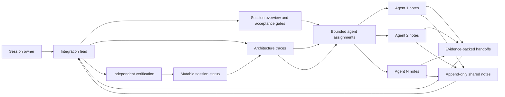

# Coordination Architecture

## Information flow

## File authority

| Artifact | Writers | Purpose |
|---|---|---|
| `OVERVIEW.md` | Session owner or integration lead | Goal, scope, constraints, and acceptance gates |
| `ARCHITECTURE.md` | Integration lead | Current, backward, and target traces |
| `STATUS.md` | Integration lead | Accepted decisions and verified state |
| `agents/*/ASSIGNMENT.md` | Integration lead | Bounded ownership and dependencies |
| `agents/*/NOTES.md` | Assigned agent | Detailed working record and local findings |
| `agents/*/HANDOFF.md` | Assigned agent | Evidence-backed completion report |
| `handoffs/shared_notes.md` | All agents, append only | Cross-agent messages, dependencies, and corrections |

## Shared-note protocol

Every entry has a stable ID, timestamp, session, sender, recipients, scope, evidence, requested action, and status. Entries are never changed after append.

If an entry is wrong:

1. Append a correction.
2. Set `Supersedes` to the earlier entry ID.
3. Explain what changed and why.
4. Let the integration lead update the mutable status and architecture if the correction is accepted.

This preserves the reasoning trail without making the current state hard to find.

## Architecture traces

Each session should maintain three views:

- **Current trace:** what the repository actually does now.
- **Backward trace:** what must have happened for the final observable result to exist.
- **Target trace:** the smallest corrected flow that satisfies the acceptance gates.

Color nodes and connections by evidence:

- Green: proved end to end.
- Amber: component works, connection or failure behavior is not proved.
- Red: broken, missing, or contradicted by evidence.
- Gray: outside the current repair scope or not yet inspected.
