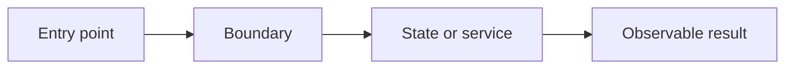
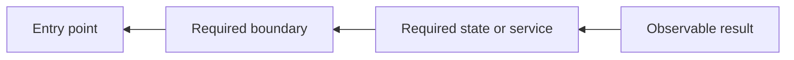
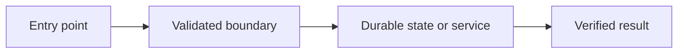

# Architecture Map

## Legend

- Green: verified end to end
- Amber: partial or isolated proof
- Red: broken or missing
- Gray: not inspected or outside scope

## Current Forward Trace

## Current Backward Trace

Start with the observable result and trace each required dependency back to the entry point.

## Target Trace

Show the smallest corrected architecture. Mark new or changed connections clearly.

## Known Divergences

| Connection | Current evidence | Target behavior | Owner |
|---|---|---|---|

